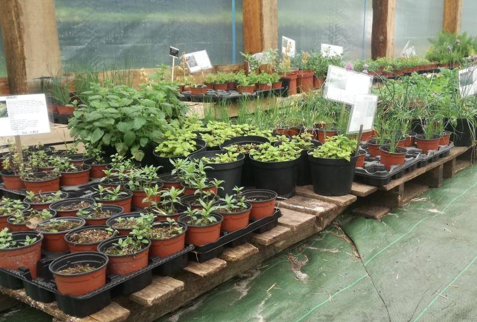

## Jardin Gourmand

Le jardin gourmand propose depuis 2014 un large choix de plants aromatiques, fraisiers et petits fruits, plants potagers (seulement des variétés anciennes donc ressemables à l’opposé des hybrides), des arbres fruitiers et autres fleurs alliées du jardinier. 

Sans produit chimique de synthèse donc, parce que la nocivité des pesticides, fongicides et autres herbicides n’est plus à prouver, le tout rimant assez bien avec suicide, et que les engrais minéraux ne nourrissent pas le sol qui donc s’appauvrit et meurt alors qu’il est le plus adapté à subvenir aux besoins des plantes. Autour de la pépinière qui se résume à une grande serre de 300m2 et quelques carrés aromatiques contenant nos pieds mères, la partie maraîchage se développe sur 5000m2 et nous vendons désormais une grande variété de légumes issus de nos propres plants.