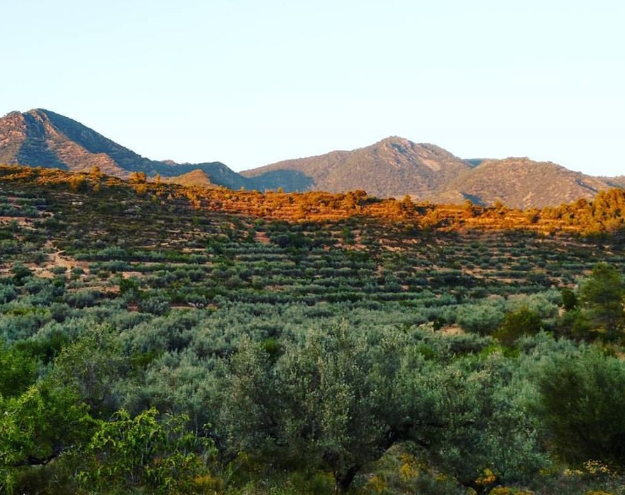
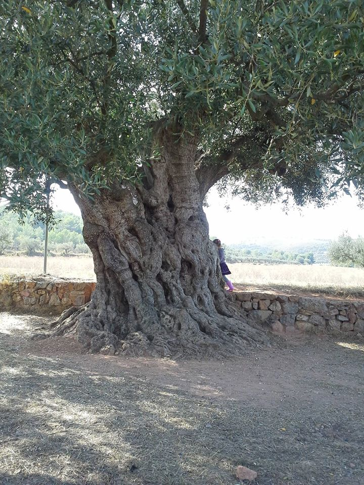

## Sabores de Vida

Intégrés dans le cadre du projet Sabores de Vida, plusieurs producteurs adhérant aux engagements de qualité, coopération, Agro-écologie, protection du patrimoine naturel et culturel, et développement de notre territoire rural se sont regroupés en coopérative. Ils s'engagent à garantir la qualité des produits et aussi des pratiques de producteurs engagés. Ces producteurs indépendants, proches géographiquement (Sagunto, Nulles et Segorbe) : Guillermo, Gonzalo, Constanti, et David.

### Saborita
Au nord de Valence, au cœur des parcs Naturels de la Sierra de Espadan et de la Sierra Calderona, Noël et David Moya Fernandez cultivent des oliviers centenaires. Ils nous porposent plusieurs variétés d'huile d'olive ainsi que des amandes, du riz et de la charcuterie fournis par des amis producteurs.

#### Huile d'olive

Ils nous proposent une huile d’olive vierge extra, la meilleure catégorie espagnole, dénomination « Zumo de Aceituna » (Jus d’Olive), première extraction mécanique et à froid, sans mélanges ni additif, et produite de manière traditionnelle.

Ce qui fait sa spécificité est d’être parfumée, très fruitée, tout en n’étant pas du tout acide ni amère. Cela lui confère une douceur qui ne cache pas le goût d’autres ingrédients du repas, mais les accompagne avec ce parfum très fruité. Malgré sa faible acidité, la variété d’olive « Serrana » produit une huile qui se conserve longtemps, à différence de la plupart des huiles subtiles.

#### Processus de fabrication

L’huile est extraite sur “ultra” froid, c’est à dire, non seulement les olives ne sont pas chauffées, mais le moulin mécanique a un système de ventilation pour réduire la température que la propre friction des noyaux fait augmenter. Cela se passe donc entre 16 et 20 degrés, en fonction de la température ambiante (mois de novembre).

Il s’agit d’un jus pur d’olive, rien d’autre. Le filtrage est uniquement mécanique.

La séparation de la partie aqueuse du jus de l’olive se fait par décantation et ensuite mécanique, par centrifugation, sans solvants.

L’huile est conservée dans des cuves en acier, dans des conditions à faible contenu en oxygène et à basse température, pour minimiser l’oxydation et la perte de propriétés.