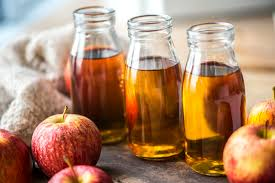
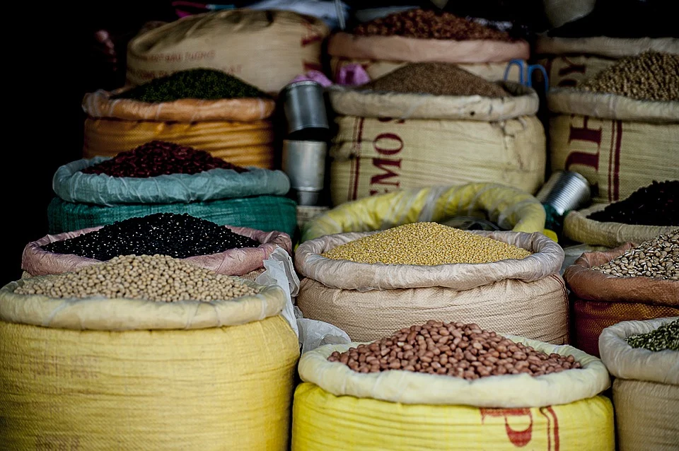
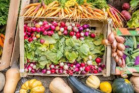
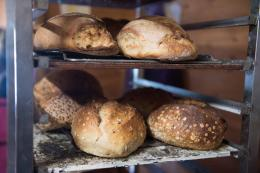

<section id="ghTree" class="ghTree" data-title="tree">
    <header>
        <h1>Catégories des produits distribués par Gourmandignes</h1>
    </header>
    

        <!--
        {{ cat | jsonify }}
        <ul>
          
            <li><a href="index.html#{{ tag }}">{{ tag }}</a></li>
            
        </ul>
        -->

  

    

        

                <a class="ghTreeReadmore" href="../boissons">Boissons</a>
        

        

            
        

    

    

        

                <a class="ghTreeReadmore" href="../cremerie">Crèmerie</a>
        

        

            
        

    

    

        

                <a class="ghTreeReadmore" href="../epicerie">Épicerie</a>
        

        

            
        

    

    

        

                <a class="ghTreeReadmore" href="../legumes">Fruits & Légumes</a>
        

        

            
        

    

    

        

                <a class="ghTreeReadmore" href="../viandes">Viandes</a>
        

        

            
        

    

    

        

                <a class="ghTreeReadmore" href="../boulangerie">Boulangerie & Pâtisserie</a>
        

        

            
        

    

    

        

                <a class="ghTreeReadmore" href="../maison">Maison & Jardin</a>
        

        

            
        

    

</section>