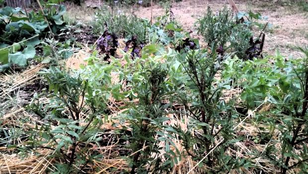

# Association Gourmandignes de Cenon
## Composteur partagé

L'association Gourmandignes anime avec l'aide des associations Au ras du Sol et Germain veille un espace de compostage partagé fourni par les services de Bordeaux métropole.

Ce dispositif permet aux adhérent.es mais aussi des habitant.es du quartier de trier leurs déchets organiques en les apportant dans les composteurs collectifs mis à disposition. Le compost produit est utilisé sur place dans le jardin partagé en cours de développement et mis à disposition des participant.es pour leurs jardins ou balcons.

Cet espace de compostage est constitué d'un bac de déchets bruns permettant d'apporter du carbone au compost, d'un bac de compostage et d'un bac de maturation dans lequel le compost en cours de maturation est déposé pour une période de 3 mois.

