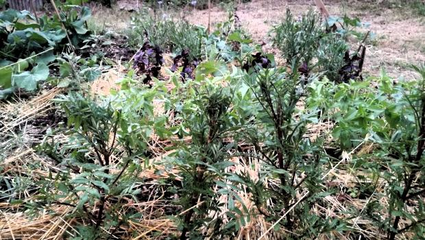

---
titre:
description:
date:
---

# Association Gourmandignes de Cenon
## Présentation générale

L'association Gourmandignes **a pour objet de regrouper des consommateurs conscients et désireux de s'impliquer dans l'économie solidaire**, de mettre en relation les adhérents et les producteurs, d'organiser des relations entre les partenaires et **la distribution des produits dans le cadre d'une gestion désintéressée** et de **recréer un lien social entre le monde urbain et le monde rural** en mettant en place notamment des ateliers de jardinage sur la ferme ou toute autre activité en lien avec l'objet.

## Historique

L'assocation a été créé en juillet 2010 par un groupe de neuf membres fondateurs. Elle a lancé ses activités autour de la mise en relation d'un producteur maraîcher situé près de Langon et d'une douzaine de famille. Après quelques mois d'activitiés un producteurs d'oeufs et de volailles a rejoint l'association et de nouvelles familles ont rejoint le groupement.

Au fur et à mesure des années, le nombre de familles adhérentes de l'association a augmenté pour atteindre aujourd'hui 92. 

Chaque famille verse une cotisation de 15€ par an qui permet de couvrir les frais de fonctionnement et de **constituer une caisse de solidarité à destination des producteurs**.

De nouveaux producteurs ont rejoint l'association en proposant de nouveaux produits. Aujourd'hui vous avez le choix parmis 15 producteur.rice.s, majoritairement girondin et **pour la plupart certifiés en agriculture biologique**.

## Principes de fonctionnement

L'association met en relation des producteurs et des consommateurs pour **faciliter l'écoulement local de la production** d'une part et **pour fournir des produits frais ou au meilleur coût** de l'autre. Cette mise en relation est effectuée par le biais d'un contrat qui fixe les engagements des parties.

**L'association ne perçoit pas de rémunération au travers de cette mise en relation**. Son rôle consiste à trouver les producteurs ou à répondre à leurs sollicitations puis à évaluer l'adéquation entre leur offre et la charte de l'assocation. En effet, cette charte reprend les valeurs promues par **la confédération paysanne en faveur d'une agriculture locale, respectueuse de l'environnement, n'utilisant pas d'entrants chimiques et permettant au producteur de vivre correctement de son activité**.

Par ailleurs, l'association opère le lieu de distribution et contribue à l'organisation des temps de distribution organisés chaque semaine.

Les principes généraux qui unissent les 3 parties en présence (association, producteurs et consommateurs) sont **la confiance et la solidarité**. La confiance se base sur les engagements des producteurs à respecter leur environnement en ayant le moins d'impacts négatifs et si possible un impact positif sur celui-ci. Les producteurs proposent également aux consommateurs de **se rendre sur le lieu de production et d'effectuer des visites de l'exploitation**. En plus de leur vertue pédagogique cette visite peut remplacer le processus de certification car il permet aux consommateurs de constater de leurs propres yeux que les denrées qu'ils achètent sont produites en conformité avec le cahier des charges de l'agriculture biologique.

La solidiarité s'exprime suivant deux axes. Le premier est **l'engagement des consommateurs dans la durée**. Par la signature d'un contrat d'un an et le versement éventuel des sommes requises à l'avance, il s'engage et **permet en retour au producteur d'avoir une visibilité sur ses revenus annuels**. Cette visibilité permet également au producteur de calibrer sa production en fonction de la demande.

Le second des engagements solidaires s'exprime lors des **aléas de production**. Lorsque un producteur est frappé par une calamité naturelle (inondation, sécheresse, etc...) les adhérents payent les produits qui ne sont pas livrés. En retour ils bénéficient des excédents de production et permettent au producteur de poursuivre son activité malgré les aléas. Ponctuellement cette solidarité peut s'exprimer par un don de temps pour remettre en place une serre ou récolter un excédent de production.

## Gouvernance

**L'association élit un conseil d'administration composé de 3 à 9 membres pour prendre en charge la coordination générale de l'association**.

A l'intérieur de ce conseil un bureau est désigné. Celui-ci est constitué de 3 coordinateurs généraux s'occupant des fonctions de représentation, de comptabilité, de coordination et de gestion.

Les adhérents pouvant prendre part au vote sont ceux qui ont réglé leur cotisation annuelle à raison d'un vote par famille.

Pour faciliter la mise en relation entre le producteur et les consommateurs adhérents au contrat qu'il propose, un [coordinateur bénévole](./coordinateurs/) se propose. Celui-ci contribue à la gestion du contrat en en rédigeant éventuellement les modalités en lien avec le.a producteur.rice et surtout en gérant les commandes régulières ou ponctuelles en fonction des spécificités de chaque contrat. Il sert d'interface entre le producteur et le consommateur. Il doit être tenu au courant de tous les évènements pouvant intéresser les adhérents et relayer ces informations auprès d'eux. Il peut également organiser des visites sur le lieu de production et contribuer à l'organisation de la distribution.

**Pour finir les adhérents prennent part à l'organisation du fonctionnement de l'association en se proposant pour effectuer des permanence de distribution ou en se rendant sur le lieu de l'exploitation pour donner un coup de main.**

# Activités

L'activité principale de l'association est d'organiser la distribution des produits des producteurs locaux avec lesquels elle travaille.

Chaque semaine les producteurs amènent leurs produits sur le lieu de distribution et les distribuent aux adhérents de leur contrat. Lorsque cela est possible, les producteurs participent à la distribution et informent les adhérents sur les nouvelles de l'exploitation.

Dans les engagements des adhérents il est stipulé qu'ils doivent venir prendre en charge leurs produits aux jours et horaires indiqués. Il arrive parfois qu'ils oublient ou qu'ils soient dans l'impossibilité de venir récupérer leurs produits. **D'un commun accord, les producteurs et les adhérents ont donc décidé de donner les produits non pris en charge à l'issue de la distribution à une association agissant dans le domaine de l'économie sociale et solidaire.** L'association gourmandignes a donc successivement contractualisé avec l'APAFED, le CCAS de Cenon, le foyer Génilor et le secours catholique pour la récupération à titre gracieux des produits non pris en charge.

L'association organise également régulièrement pour les adhérents des visites sur les lieux d'exploitation à caractère pédagogique.

Enfin l'association organise une à deux fois par an des journées portes ouvertes. A cette occasion plusieurs activités sont proposées aux adhérents et aux visiteurs. A chacune d'entre elles la restauration disponible est acquise auprès des producteurs. Ensuite soit les produits sont offerts aux visiteurs sous la forme d'une dégustation, soit ils sont vendus sous la forme d'une assiette gourmande. Lors de la journée portes ouvertes, l'association et ses bénévoles tiennent un stand pour informer les visiteurs sur les différents contrats disponibles si possible en présence des producteurs.