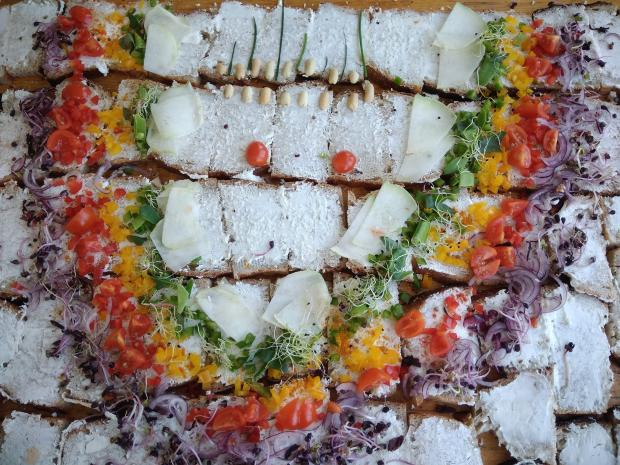

---
titre:
description:
date:
layout: default
---

L'association Gourmandignes espère contribuer au développement d'un **intérêt collectif**. Alimentaire mais pas que.

Elle repose sur une bande de **joyeux voisins à cercles excentriques**, des **paysan.ne.s engagé.e.s** et des **habitant.e.s solidaires**.

Ses valeurs sont issues des chartes de l'**agriculture paysanne et de l'économie solidaire**.

Elle fonctionne grâce à la **participation des bénévoles et l'implication des membres actifs** et/ou coordinateur.rice.s.

Les contrats obéissent aux règles fixées par les [statuts](./statuts.html), la [charte](./charte.html) et le [règlement intérieur](./reglement.html) de l'association. Vous devez prendre connaissance de ces documents avant d'adhérer.

Dans le cadre de votre adhésion, vous vous engagez à prendre en charge chaque semaine les livraisons qui correspondent à vos [contrats](./contrats/) et à effectuer une permanence de temps à autre pour l'heure de [distributions](./distribution.html).

Vous pourrez trouver des informations plus détaillés dans les pages ci-dessous :

* [présentation](gourmandignes.html)
* [statuts](statuts.html)
* [réglement intérieur](reglement.html)
