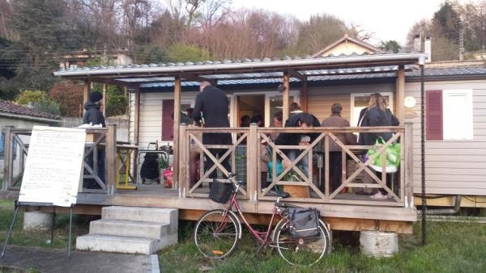

# Bienvenue

Pour l'[association gourmandignes](./gourmandignes/gourmandignes.html) deux principes ont guidé l'idée de la création d'une AMAP en 2010 sur le territoire de Cenon :

* soutenir des [paysans](./producteurs/) pour leur permettre d'exercer leur activité en dégageant un salaire décent à proximité de l'agglomération bordelaise
* soutenir la possibilité d'une alimentation saine et de qualité quel que soit le milieu social.

En effet, bien souvent l'alimentation biologique est considérée comme un privilège dont seraient exclus les plus pauvres. Au travers de cette association et des animations que nous souhaitons organiser avec notre réseau de [producteurs](./producteurs/), nous espérons pouvoir prouver le contraire et favoriser la diffusion de ce mode de consommation alternatif.

L'ensemble des [contrats](./contrats/) avec les [producteurs](./producteurs/) est lié à l'adhésion à l'[association gourmandignes](./gourmandignes/gourmandignes.html). La cotisation est de 17 € par an (ou 8.5 € si l'adhésion a lieu après le 1er juillet de l'année en cours).

Les [distributions](./gourmandignes/distribution.html) s'effectuent le jeudi soir de 19h à 20h dans le chalet à gauche du parking de la mairie de Cenon.

Pour adhérer vous pouvez contacter la secrétaire de l'association, Camille Maguerez ou nous écrire par email à gourmandignes at gmail.com
Vous pouvez également vous rendre sur place pour signer un contrat d'adhésion qui prendra effet la semaine suivante.

Les contrats obéissent aux règles fixées par les [statuts](./gourmandignes/statuts.html), la [charte](./gourmandignes/charte.html) et le [règlement intérieur](./gourmandignes/reglement.html) de l'[association](./gourmandignes/gourmandignes.html). Vous devez prendre connaissance de ces documents avant d'adhérer à l'[association](./gourmandignes/gourmandignes.html).

Dans le cadre de votre adhésion, vous vous engagez à prendre en charge chaque semaine les livraisons qui correspondent à vos [contrats](./contrats/) et à effectuer une permanence de temps à autre pour l'heure de [distributions](./gourmandignes/distribution.html).