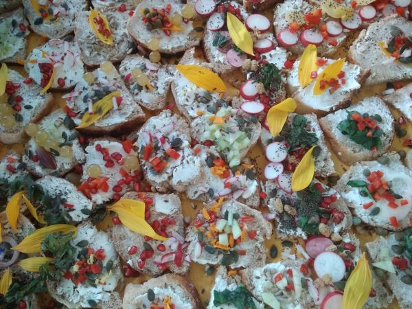
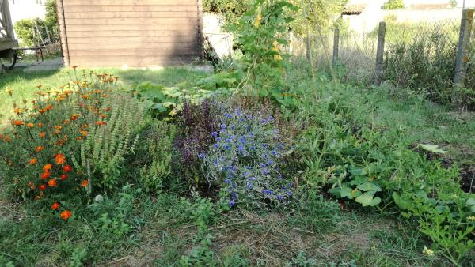

# Bienvenue

Deux principes ont accompagné la création d'une **AMAP** par l'[association gourmandignes](./gourmandignes/gourmandignes.html) en 2010 sur le territoire de Cenon : 

* **Soutenir des [paysans](./producteurs/)** pour leur permettre d'obtenir une rémunération décente pour leur activité en vivant à proximité de l'agglomération bordelaise,
* contribuer à l'accessibilité à une **alimentation saine et de qualité quel que soit le milieu social**.

On s'active donc à partir de notre local situé à proximité de l'espace Simone Signoret (Marie de Cenon) et dans les communes de la rive droite pour proposer de faire la rencontre d'une **quinzaine de chouettes producteur.rice.s locaux**. 

L'**alimentation** biologique est encore souvent considérée comme un **privilège**. En associant producteur.rice.s et adhérent.e.s dans une **relation de confiance** nous essayons d'**imaginer d'autres modes de relation que la consommation ou la certification**. Au travers de cette association et des actions que nous organisons avec notre réseau de [producteur.rice.s](./producteurs/), nous espérons **contribuer à l'accessibilité des produits et de ces modes d'échanges**.

## Adhésion
Pour formaliser cette relation, nous vous proposons d'adhérer à un ou plusieurs des [contrats](./contrats/) direct avec les [producteur.rice.s](./producteurs/). Leur accès est lié à l'adhésion à l'[association gourmandignes](./gourmandignes/gourmandignes.html) mais l'assocation ne sert pas d'intermédiaire. La cotisation est de 15 € par an (ou 7.5 € si l'adhésion a lieu après le 1er juillet de l'année en cours).

Les [distributions](./gourmandignes/distribution.html) s'effectuent le **jeudi soir de 19h à 20h dans le chalet à gauche du parking de la mairie de Cenon**.

Vous pouvez nous écrire à gourmandignes at gmail.comou ou vous rendre sur place pour faire connaissance. Vous y découvrirez une aire de compostage, un petit potager et plein de chaleur humaine !

